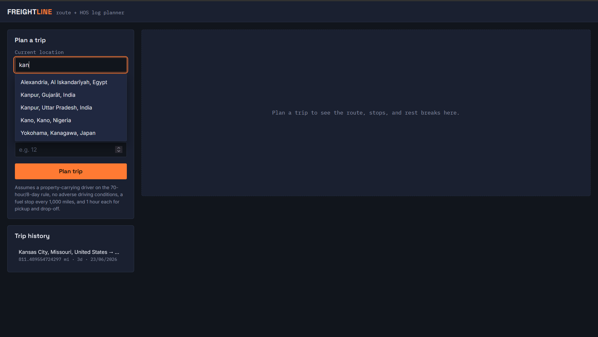
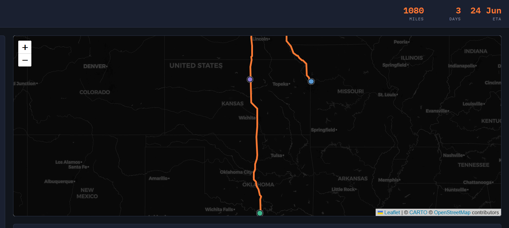
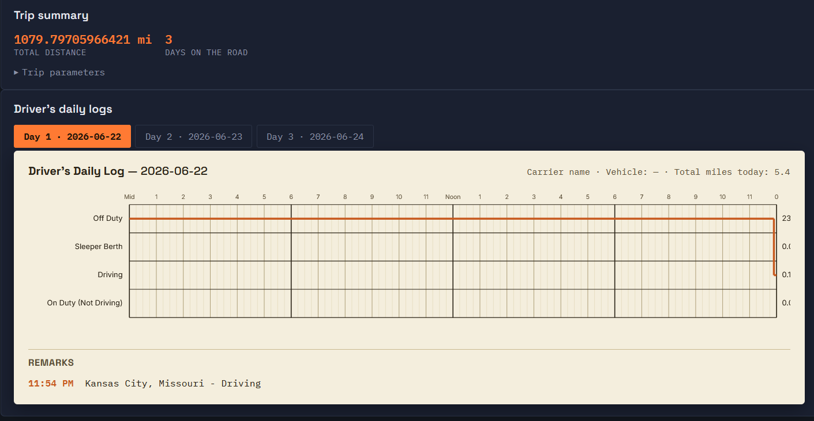

# Freightline — Route & HOS Log Planner

[](https://www.python.org/)
[](https://www.djangoproject.com/)
[](https://reactjs.org/)
[](https://opensource.org/licenses/MIT)

Freightline is a full-stack web application designed for the logistics and transportation industry. It calculates driving routes between locations and **automatically simulates a fully compliant Federal Motor Carrier Safety Administration (FMCSA) Hours of Service (HOS) log** for the trip.

**Stack:** Django + Django REST Framework (Backend) | React + Vite (Frontend)  
**Maps/Routing:** Local SQLite City Database (autocomplete) + OSRM (routing) + Leaflet (rendering)

---

## Screenshots


*Fast offline autocomplete for city selection.*


*Interactive map showing the routed path and generated stops.*


*Automatically generated FMCSA-compliant HOS log sheets split across multiple days.*

---

## Features & Architecture

### 1. Trip Planning & Routing
Given a current location, pickup, drop-off, and hours already used in the 70-hour/8-day cycle, the application queries an offline database for coordinates and fetches exact driving geometry and duration using the Open Source Routing Machine (OSRM).

### 2. FMCSA Hours of Service Simulation
It runs an Hours-of-Service simulation that inserts every break, rest, fuel stop, and cycle restart the regulations require along the way.
**Modeled Regulations:**
- 11-hour driving limit
- 14-hour on-duty window
- 30-minute break after 8 hours of cumulative driving
- 10-consecutive-hour resets
- The 70-hour/8-day limit with 34-hour restart

### 3. Log Generation
The backend splits the resulting duty timeline into one 24-hour log sheet per day, fully filled out with duty-status grids, daily totals, and location-aware remarks for every status change.

### 4. Zero N+1 Queries
Database writes are batched into a single `bulk_create()` operation, and reads utilize `prefetch_related()` to ensure that loading a massive 7-day trip requires the exact same number of fixed SQL queries as a 1-day trip.

---

## Project Layout

```
eld-trip-planner/
├── backend/
│   ├── worldcities.csv        City database for fast, offline autocomplete
│   ├── eld_planner/           settings, urls (env-driven)
│   └── trips/
│       ├── views.py           plan-trip, trip list/detail endpoints
│       ├── serializers.py     request validation + response shapes
│       ├── exceptions.py      DRF exception handler (no leaked internals)
│       ├── models.py          Trip / TripStop / DailyLog / Segment / Remark / City
│       └── services/
│           ├── geocoding.py   City model queries + Nominatim fallback
│           ├── routing.py     OSRM wrapper (fetches pathing/distance/duration)
│           ├── hos.py         HOS simulation engine
│           └── logsheets.py   Splits the timeline into daily log sheets
└── frontend/
    └── src/
        ├── api.js             API integration
        └── components/        React component architecture
```

---

## Running Locally

### Backend Setup

1. Navigate to the backend directory and set up a virtual environment:
   ```bash
   cd backend
   python -m venv venv
   source venv/bin/activate  # On Windows use: venv\Scripts\activate
   ```
2. Install dependencies:
   ```bash
   pip install -r requirements.txt
   ```
3. Copy environment variables and apply migrations:
   ```bash
   cp .env.example .env
   python manage.py migrate
   ```
4. **Crucial:** Load the local city database for the fast autocomplete feature:
   ```bash
   python manage.py load_cities
   ```
5. Start the server:
   ```bash
   python manage.py runserver
   ```

### Frontend Setup

1. Navigate to the frontend directory:
   ```bash
   cd frontend
   ```
2. Install dependencies:
   ```bash
   npm install
   ```
3. Copy environment variables:
   ```bash
   cp .env.example .env
   ```
4. Start the development server:
   ```bash
   npm run dev
   ```
5. Open `http://localhost:5173` in your browser.

---

## Deployment

### Backend (Render / Heroku)
1. Use the `backend` folder as the root directory.
2. **Build Command:** `pip install -r requirements.txt && python manage.py migrate && python manage.py load_cities`
3. **Start Command:** `gunicorn eld_planner.wsgi:application --bind 0.0.0.0:$PORT`
4. **Environment Variables:** `DJANGO_DEBUG=False`, `DJANGO_SECRET_KEY=<secret>`

### Frontend (Vercel / Netlify)
1. Use the `frontend` folder as the root directory, using the Vite framework preset.
2. **Environment Variable:** `VITE_API_BASE_URL=https://<your-backend-domain>/api`

---

## Contributing

Contributions are what make the open source community such an amazing place to learn, inspire, and create. Any contributions you make are greatly appreciated.

Please refer to the [Contributing Guidelines](CONTRIBUTING.md) for detailed instructions on how to submit issues, feature requests, and Pull Requests.

---

## License

Distributed under the MIT License. See `LICENSE` for more information.

---

## Notes for Developers

- **Mapping/Routing:** The app currently relies on the public OSRM demonstration server (`router.project-osrm.org`) for routing. While acceptable for development, this server is rate-limited. For production scale, swap `OSRM_BASE_URL` in `trips/services/routing.py` to a self-hosted OSRM instance or a commercial alternative (Mapbox, Google Maps).
- **Coordinate Systems:** The backend receives GeoJSON geometries (`[lon, lat]`) from OSRM. Note that Leaflet expects geometries as `[lat, lon]`. The backend specifically handles this transformation in `routing.py` before serving the payload to the frontend.
